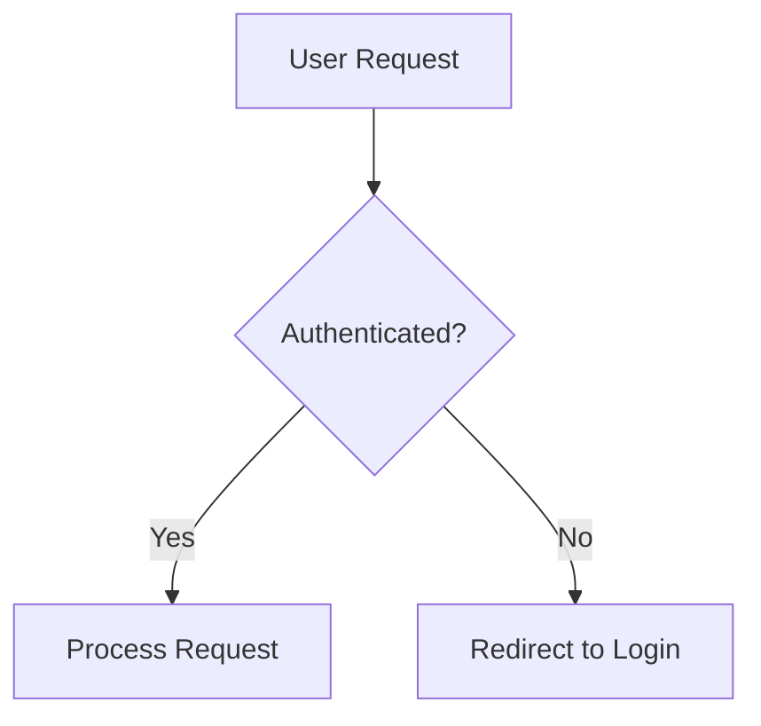

# Docusaurus -- Customization & Deployment

> Swizzling, CSS theming, versioning, i18n, search, and deployment patterns. Reference from [SKILL.md](../SKILL.md).

**Related examples:**

- [core.md](core.md) -- Site configuration, sidebars, navbar, custom pages
- [content.md](content.md) -- MDX features, admonitions, tabs, code blocks, blog plugin

---

## Swizzling Theme Components

### Wrap vs Eject

**Wrapping** (recommended) adds behavior around the original component. Upstream updates still apply.

```bash
npx docusaurus swizzle @docusaurus/theme-classic Footer -- --wrap
```

Creates `src/theme/Footer/index.js`:

```jsx
import React from "react";
import Footer from "@theme-original/Footer";

export default function FooterWrapper(props) {
  return (
    <>
      <Footer {...props} />
      <div className="custom-footer-banner">Built with love</div>
    </>
  );
}
```

**Ejecting** gives you the full component source. You own all future maintenance.

```bash
npx docusaurus swizzle @docusaurus/theme-classic Footer -- --eject
```

### Swizzle Safety Levels

```bash
# Check safety levels before swizzling
npx docusaurus swizzle --list
```

| Level         | Meaning                                           | Recommendation         |
| ------------- | ------------------------------------------------- | ---------------------- |
| **Safe**      | Stable API, unlikely to break on updates          | Wrap or eject freely   |
| **Unsafe**    | Internal API may change between minor versions    | Wrap only, avoid eject |
| **Forbidden** | Cannot be swizzled (critical internal components) | Do not swizzle         |

### Common Swizzle Targets

| Component         | Safety | Common Use Case                     |
| ----------------- | ------ | ----------------------------------- |
| `Footer`          | Safe   | Add banner, analytics, custom links |
| `DocItem/Footer`  | Safe   | Add feedback widget below docs      |
| `DocSidebar`      | Unsafe | Custom sidebar behavior             |
| `NavbarItem`      | Unsafe | Custom navbar item types            |
| `ColorModeToggle` | Safe   | Custom dark/light toggle UI         |
| `NotFound`        | Safe   | Custom 404 page                     |
| `Root`            | Safe   | Add global providers or wrappers    |

### TypeScript Swizzling

```bash
npx docusaurus swizzle @docusaurus/theme-classic Footer -- --wrap --typescript
```

Creates `.tsx` instead of `.js` in `src/theme/`.

---

## CSS Theming

### Custom CSS Properties

Docusaurus theming is built on CSS custom properties. Override them in `src/css/custom.css`:

```css
/* src/css/custom.css */
:root {
  --ifm-color-primary: #2e8555;
  --ifm-color-primary-dark: #29784c;
  --ifm-color-primary-darker: #277148;
  --ifm-color-primary-darkest: #205d3b;
  --ifm-color-primary-light: #33925d;
  --ifm-color-primary-lighter: #359962;
  --ifm-color-primary-lightest: #3cad6e;
  --ifm-code-font-size: 95%;
  --ifm-font-family-base: "Inter", system-ui, sans-serif;
  --ifm-heading-font-family: "Inter", system-ui, sans-serif;
  --docusaurus-highlighted-code-line-bg: rgba(0, 0, 0, 0.1);
}

[data-theme="dark"] {
  --ifm-color-primary: #25c2a0;
  --ifm-color-primary-dark: #21af90;
  --ifm-color-primary-darker: #1fa588;
  --ifm-color-primary-darkest: #1a8870;
  --ifm-color-primary-light: #29d5b0;
  --ifm-color-primary-lighter: #32d8b4;
  --ifm-color-primary-lightest: #4fddbf;
  --docusaurus-highlighted-code-line-bg: rgba(0, 0, 0, 0.3);
}
```

**Key insight:** Use the [Docusaurus color generator](https://docusaurus.io/docs/styling-layout#styling-your-site-with-infima) to generate the full primary color palette from a single hex value. All 7 shades must be consistent.

### Infima CSS Framework

Docusaurus uses Infima as its underlying CSS framework. Key variables:

| Variable                        | Controls            | Default     |
| ------------------------------- | ------------------- | ----------- |
| `--ifm-color-primary`           | Primary brand color | `#2e8555`   |
| `--ifm-font-size-base`          | Base font size      | `1rem`      |
| `--ifm-spacing-horizontal`      | Horizontal padding  | `1rem`      |
| `--ifm-container-width`         | Max content width   | `1140px`    |
| `--ifm-navbar-height`           | Navbar height       | `3.75rem`   |
| `--ifm-footer-background-color` | Footer background   | theme-based |

### Custom Fonts

```css
/* src/css/custom.css */
@import url("https://fonts.googleapis.com/css2?family=Inter:wght@400;500;600;700&display=swap");

:root {
  --ifm-font-family-base: "Inter", system-ui, -apple-system, sans-serif;
  --ifm-heading-font-family: "Inter", system-ui, -apple-system, sans-serif;
  --ifm-font-family-monospace: "JetBrains Mono", "Fira Code", monospace;
}
```

---

## Doc Versioning

### Creating a Version

```bash
# Snapshot current docs/ as version 2.0
npx docusaurus docs:version 2.0
```

This creates:

```
versioned_docs/version-2.0/     # Full copy of docs/
versioned_sidebars/version-2.0-sidebars.json  # Copy of sidebars.js
versions.json                    # ["2.0"]
```

After this, `docs/` becomes the "next" (unreleased) version.

### Version Configuration

```javascript
// In preset-classic docs options
docs: {
  lastVersion: 'current',
  versions: {
    current: {
      label: '3.0.0-alpha',
      path: 'next',
      banner: 'unreleased',
    },
    '2.0': {
      label: '2.0.0 (stable)',
      path: '2.0',
      banner: 'none',
    },
    '1.0': {
      label: '1.0.0',
      path: '1.0',
      banner: 'unmaintained',
    },
  },
  // Speed up dev builds by only including specific versions
  onlyIncludeVersions: process.env.NODE_ENV === 'development'
    ? ['current']
    : undefined,
},
```

### Version Dropdown in Navbar

```javascript
// In themeConfig.navbar.items
{ type: 'docsVersionDropdown', position: 'right', dropdownActiveClassDisabled: true },
```

### Version Banner Types

| Banner           | Behavior                                                    |
| ---------------- | ----------------------------------------------------------- |
| `'none'`         | No banner (current/latest version)                          |
| `'unreleased'`   | "This is unreleased documentation" warning                  |
| `'unmaintained'` | "This is documentation for an unmaintained version" warning |

### Versioning Gotchas

- Each version is a **full copy** of `docs/`. 10 versions = 10x the content to build.
- Use `onlyIncludeVersions` during development to avoid slow builds.
- To fix a typo in a released version, edit `versioned_docs/version-X.Y/`, not `docs/`.
- `versions.json` is automatically managed -- do not hand-edit it unless removing a version.
- Versioned sidebars in `versioned_sidebars/` are JSON (not JS), even if your source `sidebars.js` is JavaScript.

---

## Internationalization (i18n)

### Configuration

```javascript
// docusaurus.config.js
export default {
  i18n: {
    defaultLocale: "en",
    locales: ["en", "fr", "ja"],
    localeConfigs: {
      en: { label: "English", direction: "ltr", htmlLang: "en-US" },
      fr: { label: "Francais", direction: "ltr", htmlLang: "fr-FR" },
      ja: { label: "Japanese", direction: "ltr", htmlLang: "ja-JP" },
    },
  },
};
```

### Translation Workflow

```bash
# 1. Extract translatable strings
npx docusaurus write-translations --locale fr

# Creates i18n/fr/ directory with JSON translation files

# 2. Translate the JSON files
# i18n/fr/docusaurus-theme-classic/navbar.json
# i18n/fr/docusaurus-plugin-content-docs/current.json

# 3. Copy docs for translation
mkdir -p i18n/fr/docusaurus-plugin-content-docs/current
cp -r docs/* i18n/fr/docusaurus-plugin-content-docs/current/

# 4. Build for a specific locale
npx docusaurus build --locale fr

# 5. Start dev server for a locale
npx docusaurus start --locale fr
```

### Locale Dropdown in Navbar

```javascript
// In themeConfig.navbar.items
{ type: 'localeDropdown', position: 'right' },
```

### i18n Directory Structure

```
i18n/
  fr/
    docusaurus-theme-classic/
      navbar.json           # Navbar labels
      footer.json           # Footer labels
    docusaurus-plugin-content-docs/
      current/              # Translated docs (mirrors docs/)
        intro.md
        guides/
          setup.md
      current.json          # Sidebar labels
    docusaurus-plugin-content-blog/
      2024-01-15-post.md    # Translated blog posts
```

---

## Search Configuration

### Algolia DocSearch

```javascript
// docusaurus.config.js
export default {
  themeConfig: {
    algolia: {
      appId: "YOUR_APP_ID",
      apiKey: "YOUR_SEARCH_ONLY_API_KEY", // Public search-only key, safe to commit
      indexName: "YOUR_INDEX_NAME",
      contextualSearch: true, // Scopes search to current version/locale
      searchParameters: {},
      searchPagePath: "search",
    },
  },
};
```

**Key notes:**

- Algolia DocSearch is **free for open-source projects** but requires applying at [docsearch.algolia.com](https://docsearch.algolia.com)
- The `apiKey` is a **search-only** key -- safe to commit. Do NOT use your admin API key.
- `contextualSearch: true` filters results by current doc version and locale
- Algolia crawls your deployed site -- it does NOT index at build time. Changes appear after the next crawl.

### Local Search Alternative

For projects that cannot use Algolia, community plugins provide local search:

```javascript
// docusaurus.config.js
export default {
  themes: [
    [
      "@easyops-cn/docusaurus-search-local",
      {
        hashed: true,
        language: ["en"],
        docsRouteBasePath: "/docs",
        indexBlog: false,
      },
    ],
  ],
};
```

Local search indexes at build time and works fully offline, but scales poorly for very large doc sets.

---

## Deployment

### Static Build

```bash
# Build production site
npx docusaurus build

# Preview locally before deploying
npx docusaurus serve
```

Output goes to `build/` -- deploy this directory to any static host.

### GitHub Pages

```javascript
// docusaurus.config.js
export default {
  url: "https://my-org.github.io",
  baseUrl: "/my-project/", // Must match repo name for project pages
  organizationName: "my-org",
  projectName: "my-project",
  deploymentBranch: "gh-pages",
  trailingSlash: false,
};
```

```bash
# Deploy to GitHub Pages
GIT_USER=<github-username> npx docusaurus deploy
```

Or use GitHub Actions:

```yaml
# .github/workflows/deploy.yml
name: Deploy to GitHub Pages
on:
  push:
    branches: [main]

permissions:
  contents: read
  pages: write
  id-token: write

jobs:
  deploy:
    runs-on: ubuntu-latest
    steps:
      - uses: actions/checkout@v4
      - uses: actions/setup-node@v4
        with: { node-version: 20 }
      - run: npm ci
      - run: npm run build
      - uses: actions/upload-pages-artifact@v3
        with: { path: build }
      - uses: actions/deploy-pages@v4
```

### Vercel / Netlify / Cloudflare Pages

No special configuration needed. Set:

- **Build command:** `npm run build`
- **Output directory:** `build`
- **Node version:** 18+

For subdirectory deployments, set `baseUrl` in `docusaurus.config.js` accordingly.

### baseUrl Gotcha

| Hosting                | `url`                      | `baseUrl`     |
| ---------------------- | -------------------------- | ------------- |
| Custom domain (root)   | `https://docs.example.com` | `/`           |
| GitHub Pages (project) | `https://org.github.io`    | `/repo-name/` |
| GitHub Pages (org)     | `https://org.github.io`    | `/`           |
| Subdirectory           | `https://example.com`      | `/docs/`      |

**Critical:** `baseUrl` must start AND end with `/`. Omitting the trailing slash breaks asset resolution.

---

## Mermaid Diagrams

Enable Mermaid for diagram rendering in Markdown:

```javascript
// docusaurus.config.js
export default {
  markdown: { mermaid: true },
  themes: ["@docusaurus/theme-mermaid"],
};
```

Then in MDX:

````mdx

````

Install the theme: `npm install @docusaurus/theme-mermaid`
